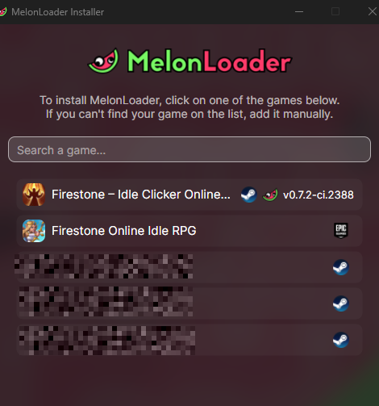
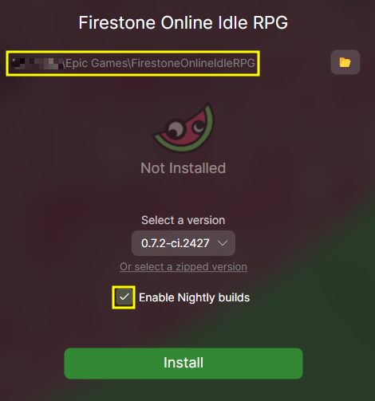
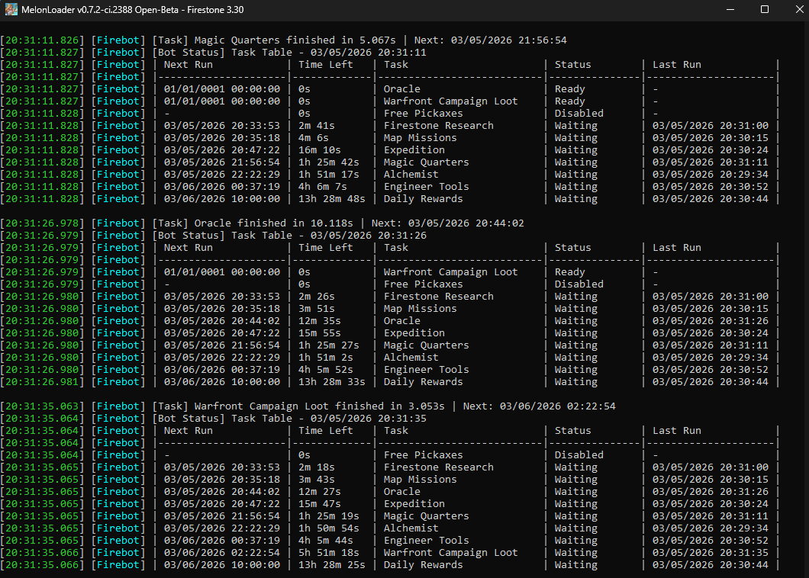

# Firebot

Automation mod for Firestone Idle RPG, built on [MelonLoader](https://github.com/LavaGang/MelonLoader).
It runs inside the game client, in the background, and is built to run many game instances side by
side on one machine.

> **Note:** Firebot runs on **Windows** only. It navigates the game's UI in any language, but a few
> choices match English text on screen - event titles, event shop items, research priorities. With
> the game in another language those tasks skip that step or fall back to their default pick.

## Disclaimer: Not a Cheat

Firebot **is not a cheat**. It does not modify game resources, grant unfair advantages, interfere with server logic, or alter game files. The bot only automates actions that a player could perform manually, without bypassing any security or protection mechanisms of the game.

> **Transparency:** Firebot is open source, and its code is publicly available for review and audit.

---

## Features

Every automation has its own section in `FirebotPreferences.cfg`, with an `enabled` switch and its
own settings. All of them are on by default except **War Machines**. None of
them spends gems or real money. The defaults follow the F2P strategy guide in
[`docs/firestone_guida_F2P.md`](docs/firestone_guida_F2P.md) (Italian).

**Bot control**

- **Start/stop** with `F7` (`shortcut_key`), or automatically at launch (`auto_start`).
- **Low resource mode** (on by default): lowest graphics quality, a frame-rate cap and a small window. The bot reads the game's scene, not rendered pixels, so this only lowers CPU/GPU load.
- **Window grid**: places each instance's window in a fixed cell of a grid on screen (`window_grid_*`).
- **Free speed-ups**: timers close enough to the end are finished for free (`free_speedup_seconds`) - Firestone research, map missions and experiments.

**In battle** (continuous, not scheduled)

- **Hero Upgrade**: levels the leader and every hero slot.
- **AutoRetreat**: when the stage stops advancing (a wall), steps back a few stages to keep farming until the next Empower.
- **Flying Bonus Hunter**: taps the flying beer dragons and meteorite hunters as they cross the screen.

**Daily quests**

- **Quests**: claims every completed daily and weekly quest.
- Collector, Gamer, Merchant and Miner read their quest's real progress on the Quests screen, do exactly what's missing, one step at a time, and claim it; a quest still short (no tokens, pickaxes, chests or items yet) is retried an hour later.
- **Collector**: opens the missing chests cheapest first (Wooden, Iron, Common, then rarer ones only if nothing cheaper is left), plus 6 extra cheap ones a day - never Common below `min_common_chest_reserve` - so the Merchant has items to sell. Jewel and celestial chests are always opened.
- **Gamer**: Tavern draws at x1 with game tokens. **Beer Exchange** turns beer into those tokens.
- **Merchant**: sells the missing items at the Exotic Merchant by name - Midas' Touch, then Scrolls of Health and Damage; never Scrolls of Speed, instant gold or meteorite items - and buys an Exotic upgrade.
- **Miner**: single hits on the Guild's Arcane Crystal.
- **Liberator** is completed by Warfront Daily Missions, below.

**Town**

- **Daily Store Offers**: the daily check-in and the two free mystery boxes.
- **Engineer**: collects the tools every 6 hours.
- **Guardian Training**: keeps a guardian training (`guardian_index`).
- **Guardian Evolution**: evolves every guardian whose evolution is available, paid in Strange Dust.
- **Experiments**: collects finished experiments and starts new ones - Dragon blood only by default (`resource_type`).
- **Firestone Research** keeps every slot busy and buys new slots when affordable; **Meteorite Research** researches whenever the balance stays above `min_meteorite_reserve`. Both prefer Raining Gold, Firestone Finder and Firestone Effect.
- **Empower** (Temple of Eternals): resets once this adventure's Firestones match the ones already banked, a +100% gain (`min_reset_ratio`).
- **Arena of Kings**: spends the daily tokens on the weakest opponent it can find.
- **Pirate's Prize**: claims the free track.
- **Oracle Rituals** and **Oracle's Gift** (character level 200).
- **System Mail**: claims every mailbox reward; never deletes mail.
- **War Machines** (off by default): levels every owned war machine. It spends the same Expedition Tokens as the Personal Tree, which the guide puts first.
- **War Machine Rarity**: raises war machine rarity with Tools, in grid order, whenever one is affordable.

**Guild**

- **Expeditions**: collects the finished expedition and starts the next one.
- **Tree of Life** (Personal): spends Expedition Tokens, priority upgrades first, spreading the rest.
- **Free Pickaxes**: when its badge shows up, claims them once `pickaxe_claim_threshold` have piled up.
- **Awakening**: spends Arcane Crystals, at the biggest multiplier available.
- **Chaos Rift**: attacks the boss with the free Moon Stones, then buys Tomes of Power with the Dark Rune (never Eclipse Stones).
- **Forbidden Knowledge**: upgrades every node the tomes can pay for, then recruits once a board is maxed.
- **Guardian Holy Upgrade**: spends Orbs of Light on each guardian's holy damage.

**Map & Warfront**

- **Map Missions**: collects finished missions and starts new ones, longest first (`mission_time_order`).
- **Warfront Campaign Loot** and **Warfront Daily Missions** (the liberation battles; the formation is set up by hand once).

**Character**

- **Talents**: spends talent points to reach as deep into the tree as possible, by configurable priority (`priority_overrides`).
- **Path of Glory**: claims the free track and, if owned, the Golden one. Never buys the pass.
- **Hall of Heroes**: spends Void Crystals on gear enchants and Ethereal Shards on jewel enchants, planned in advance from a snapshot of every hero (re-read every 24 h): gear tier unlocks first, then the lowest levels, with the Ring ahead and tier 1 only for the formation. Unlocks gear tiers, paid in Meteorites, once the gear power allows.

**Scarab's Game**

- **Pharaoh's Vault**: spins with the free Noble Tokens, opens the vault and claims the milestones.
- **Scarab Game Free Token**: the shop's free daily item.
- **Beasts**: releases the beast once the tablet has its six sigils, then spends Soul Embers on the owned beasts' levels, one level each in turn. Never touches rarity (Cobra Keys).

**Events**

- **Decorated Heroes** and **New Player Event**: claim challenges, check-ins and milestones, then spend the event currency on Dragon blood, then Meteorites, then Beer.
- **Mini Event**: every mini-event (Mass Production, Sigils of Prophecy, Stardust... - one runs every 5 days, all on one screen): claims every unlocked day's challenge.
- Paid tabs are never opened.

[TESTING.md](TESTING.md) (Italian) is the live-test runbook - written so a Claude Code session can
run it on its own - and tracks the verification status of each task.

---

## Installation

### 1) Install MelonLoader

1. Download [MelonLoader V0.7.2+](https://github.com/LavaGang/MelonLoader/releases/latest).
2. Run the MelonLoader installer.
3. In the installer, keep **Enable Nightly builds** checked and select a `0.7.2-ci` (or newer) version.
4. When asked for the game executable, select your `Firestone.exe` file (inside your Firestone install folder).
5. Finish installation and wait until the installer confirms success.

<p align="center">
   
   
</p>

<p align="center">
   <sub>Left: game selection in installer | Right: keep <strong>Enable Nightly builds</strong> checked</sub>
</p>

Start the game once with MelonLoader: it generates `MelonLoader/Il2CppAssemblies`, which the build needs.

### 2) Build Firebot

Firebot isn't published as a prebuilt release; it's built from source with the .NET SDK.

```powershell
git clone https://github.com/davide-mariotti/FirestoneBot.git
cd FirestoneBot
dotnet build src/firebot.csproj -c Release
```

The build looks for the game in `C:\Program Files (x86)\Steam\steamapps\common\Firestone` (see
`src/Directory.Build.props`). For another location, either set `COMMON_DIR` to the folder that
contains `Firestone`, or change `<GameRoot>` in that file:

```powershell
# e.g. one of several side-by-side Steam installs
$env:COMMON_DIR = "C:\Program Files (x86)\Steam-0\steamapps\common"
dotnet build src/firebot.csproj -c Release
```

The output lands in `src/bin/Release/net6.0/`. The unit tests of the talent allocator need no game:
`dotnet test tests/Firebot.TalentEngine.Tests`.

### 3) Install the mod

1. **Close the game completely** (the DLLs are locked while it runs).
2. Copy **both** `firebot.dll` and `Firebot.TalentEngine.dll` from `src/bin/Release/net6.0/` into `<Firestone>/Mods`. Without the second one the Talents task crashes with a `FileNotFoundException`.
3. Start the game, wait for it to load, press **F7**.

A build is never copied into `Mods` automatically, so a half-finished change can't replace what's
running. Updating is the same three steps with a new build.

### 4) Configure

The configuration file is `<Firestone>/UserData/FirebotPreferences.cfg`, created on the first run.
Always edit it with the game **closed** - the game rewrites the file when it exits, and changes made
while it runs are lost:

1. Close the game completely.
2. Edit and save `FirebotPreferences.cfg`.
3. Start the game again.

### 5) Logs

`<Firestone>/MelonLoader/Latest.log` is the first place to look when Firebot doesn't load, doesn't
start with `F7`, or behaves unexpectedly. Lines tagged `[FAILED]` point at the step that went wrong;
`debug_mode = true` makes the log detailed. After each task the bot prints a status table with every
task's next run.

<p align="center">
   
</p>

### 6) If the Game Updates and Firebot Stops Working

Only if a game update breaks Firebot:

**Method 1: Assembly cache cleanup**

1. Close the game completely.
2. Delete everything inside `MelonLoader/Il2CppAssemblies`.
3. In `MelonLoader/Dependencies/Il2CppAssemblyGenerator`, keep only `Il2CppAssemblyGenerator.deps.json` and `Il2CppAssemblyGenerator.dll`.
4. Delete `MelonLoader/Dependencies/AssemblyUnhollower` (if it exists).
5. Start the game again, then rebuild Firebot against the regenerated assemblies and reinstall both DLLs.

**Method 2: Reinstall MelonLoader**

1. Close the game completely.
2. Delete the `MelonLoader` folder from the game root.
3. Reinstall MelonLoader as described above and start the game once.
4. Rebuild Firebot and reinstall both DLLs.

---

## Configuration

Each section of `FirebotPreferences.cfg` is named after its feature: `[firebot_settings]` for the
bot itself, the task's class name for a task (`[collectorquesttask]`, `[mapmissionstask]`, ...), and
`[hero_upgrade]`, `[auto_retreat]`, `[flying_bonus_hunter]` for the in-battle actions. Every setting
has a comment above it, written by the version of Firebot you're running, with its meaning, default
and valid range - that's the reference. New settings are added to an existing file on the next run.

[`tools/ConfigTemplate/FirebotPreferences.template.cfg`](tools/ConfigTemplate/FirebotPreferences.template.cfg)
is a complete example: the configuration the author's instances run with.
[`apply_template.ps1`](tools/ConfigTemplate/apply_template.ps1), next to it, aligns a range of
instances to it (both copies of a sandboxed one), keeping each account's own state.

## Running many instances

[MULTI_INSTANCE_SETUP.md](MULTI_INSTANCE_SETUP.md) (Italian) covers the multi-instance setup: separate
Steam installs, Sandboxie boxes, start/stop scripts, the window grid, deploying to sandboxed
instances and the fixed pagefile that many instances need.

---

## How it works

- **Tasks** (`src/Tasks`) are scheduled jobs. `BotManager` runs one at a time: a task is ready once
  its `NextRunTime` has passed, or when one of its notification badges appears (at most once every
  30 minutes, so a badge that stays lit can't rerun its task on every scan). A task below
  its unlock level never runs, and one that runs too long is stopped; `Watchdog` then closes
  whatever screens were left open.
- **Actions** (`src/BotActions`) are continuous loops for things that happen during battle.
- **Game model** (`src/GameModel`): screens and buttons, built on a few primitives (`GameElement`,
  `GameButton`, `GameText`) that resolve Unity scene paths. The paths live in
  `src/Infrastructure/Paths`, one file per screen, holding only what the code uses. Navigation always
  clicks the full path; a notification badge is only a shortcut on top. The one exception is Free
  Pickaxes, which runs only from its badge: the path through the Guild never reached the timer.
- **Talent engine** (`src/TalentEngine`): the talent point allocator, a separate project with no
  game references, covered by `tests/Firebot.TalentEngine.Tests`.

Reference material in `docs/`: a UI map of the game's screens (`docs/index.html`), a local mirror of
the wiki (`docs/wiki`), a talents guide and the F2P guide. `tools/unity_ui_mapper.py` dumps a
screen's hierarchy straight from the game's `resources.assets`, to find new paths without launching
the game.

## Open Points

- **In-game configuration UI**: settings are edited in `FirebotPreferences.cfg` only.
- **Soul stones** (Hall of Heroes, character level 200) aren't handled.
- **War Machines** level with single clicks; the bulk multiplier isn't wired up.
- The full list of known issues and deferred work is in [TESTING.md](TESTING.md).

---

## Contributing

Contributions are welcome! Please submit a pull request or open an issue for suggestions or improvements.

## Bug Reporting & Feature Requests

Found a bug or have an idea for a new feature? Please open a ticket on the GitHub Issue Tracker.

**Before submitting a bug report:**

1. Check if the issue has already been reported.
2. Make sure you're running a build of the latest code.
3. Attach your **MelonLoader log** (`MelonLoader/Latest.log`) if the game crashed or the bot failed.

[**Open a New Issue**](https://github.com/davide-mariotti/FirestoneBot/issues/new/choose)
